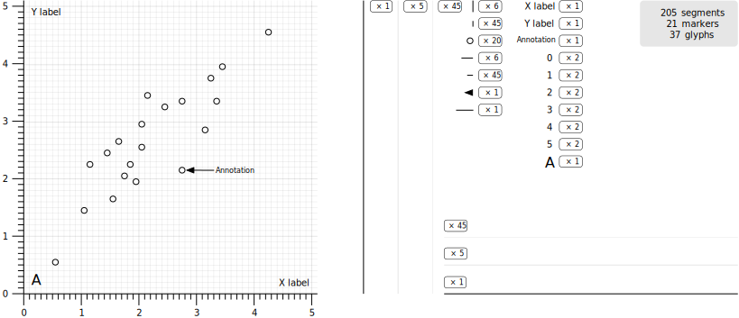

# Graphic Server Protocol

The Graphic Server Protocol (GSP) defines a protocol used between a data
visualization library and a server that executes low-level graphic commands.

<br class="clear"/>

<div class="grid cards" markdown>

-   [:octicons-book-24:{ .lg .middle } __Overview__](overview/index.md)

    ---

    The protocol defines the format of the messages sent using JSON-RPC
    between the dataviz library and the graphics server.

-   [:octicons-code-review-24:{ .lg .middle } __Specifications__](protocol/base.md)

    ---

    This document describes the protocol in every details such as to allow new
    implementations, server or client side.

*   [:octicons-gear-24:{ .lg .middle } __Implementations__](implementations/index.md)

    ---

    - Matplotlib (Python/[Antigrain](http://agg.sourceforge.net/antigrain.com/index.html))
    - [Datoviz](https://datoviz.org/) (C++/[Vulkan](https://www.vulkan.org/))
    - [pygfx](https://github.com/pygfx/pygfx) (Python/[WGPU](https://wgpu.rs))

-   :octicons-alert-16:{ .lg .middle } __Warning__

    ---

    This is a work in progress. The protocol is still in early alpha phase and
    specifications are subject to changes.

</div>

<!--

<div class="grid cards" markdown>

- :fontawesome-brands-html5: __HTML__ for content and structure
- :fontawesome-brands-js: __JavaScript__ for interactivity
- :fontawesome-brands-css3: __CSS__ for text running out of boxes
- :fontawesome-brands-internet-explorer: __Internet Explorer__ ... huh?

</div>


  :material-clock-fast: __Set up in 5 minutes__


``` title="This is block"
Some text.
```

!!! note "This is a note"

    Some note.

[This is a button](#){ .md-button }
[This is a button](#){ .md-button .md-button--primary }
[:fontawesome-solid-paper-plane: Button with icon ](#){ .md-button }


=== "C"

    ``` c
    #include <stdio.h>

    int main(void) {
      printf("Hello world!\n");
      return 0;
    }
    ```

=== "C++"

    ``` c++
    #include <iostream>

    int main(void) {
      std::cout << "Hello world!" << std::endl;
      return 0;
    }
    ```

!!! example

    === "Unordered List"

        ``` markdown
        * Sed sagittis eleifend rutrum
        * Donec vitae suscipit est
        * Nulla tempor lobortis orci
        ```

    === "Ordered List"

        ``` markdown
        1. Sed sagittis eleifend rutrum
        2. Donec vitae suscipit est
        3. Nulla tempor lobortis orci
        ```

<figure markdown>
  { width="100%" }
  <figcaption><b>Figure 1</b> Image caption</figcaption>
</figure>

-->
