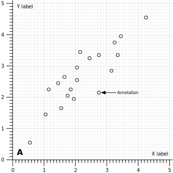
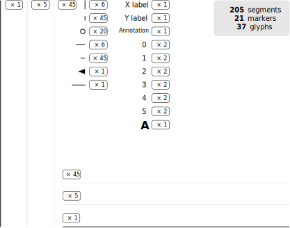

# Rationale

If you look closely at a scientific figure (**Fig. 1**), you might observe that it is actually made of a (large) set of elementary components, namely points (or markers), lines, glyphs (text) and polygons (**Fig. 2**) Glyphs, markers and polygons can be further decomposed into triangles such that the elementary components are really points, lines and triangles. When designing a scientific figure, you hardly manipulate these components explicitely. Instead, you use high-level functions that ultimately produce these elementary components. Some of these high-level functions can produce all the elements at once while some other allows you to specify only a subset of these elements.

{ align="left" width="50%"}

__Figure 1__ A regular scatter plot as it could be created by a number of
scientific libraries, with probably some variations in style.
 

What defines a scientific visualization library is the choice and the definition of these high-level functions. You can choose to have only very high-level functions that allow a user to quickly design a figure (e.g. [ggplot], [vega], [seaborn]) or you can give user more control by providing mid-level functions that allows to further tune the figure (e.g. [matplotlib], [vispy]). In the most extreme case, you might decide to give user a total freedom at the price of complexity ([TikZ]). There is no definitive API because some users will enjoy the magic of a high-level interface that takes most decisions for them, while some other users will want to have a fine control of pretty much everything.

{ align="left" width="50%"}

__Figure 2__ The figure 1 above can be decomposed in a set of markers, lines and glyphs.
 

From a developper point of view, independently of the actual library, the task
remains the same: the library needs to draw points, lines, markers, glyphs,
polygons and meshes, taking advantage of some lower-level library or doing
everything itself. Ultimately, this represent a lot of redundant efforts across
libraries.

**The graphic server protocol is a proposal to mutualize efforts across libraries, languages and platforms**.

[ggplot]: https://ggplot2.tidyverse.org/reference/ggplot.html
[vega]: https://vega.github.io/vega/
[seaborn]: https://seaborn.pydata.org/
[matplotlib]: https://matplotlib.org/
[vispy]: https://vispy.org/
[tikz]: https://en.wikibooks.org/wiki/LaTeX/PGF/TikZ

